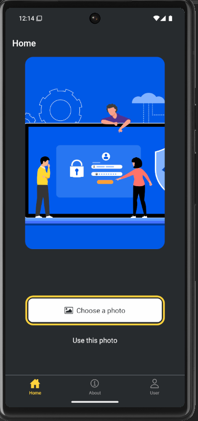

🎉 StickerSmash 🚀
Welcome to StickerSmash – the coolest way to add fun stickers 🖼️, emojis 😎, and creativity ✨ to your photos!

🚀 **Now available on the web!**  
👉 **[Visit Website 🌐](https://sticker-smash-app-reactnative.netlify.app/)**  

Built with ❤️ by Bhuvnesh Trivedi

🧐 What is StickerSmash?
StickerSmash is a React Native / Expo app 📱 that lets you:

✅ Pick an image from your gallery 🖼️
✅ Add awesome stickers & emojis 🤩
✅ Scale, rotate, and customize them 🔄
✅ Save & share your final masterpiece 📤

It’s lightweight ⚡, easy-to-use 🧩, and 100% fun!

🛠️ Tech Stack
⚛️ React Native + Expo

🎨 Styled with React Native Stylesheet

🖼️ Expo ImagePicker for photo selection

✍️ GestureHandler for sticker drag & drop

## output 

🚀 Getting Started
1️⃣ Clone this repo

bash
Copy
Edit
git clone https://github.com/Bhuvnesh-Trivedi/Sticker_Smash_App.git
cd stickersmash
2️⃣ Install dependencies

bash
Copy
Edit
npm install
# or
yarn install
3️⃣ Run the app

bash
Copy
Edit
npx expo start
4️⃣ Scan the QR 📸 on your phone using Expo Go App ✅

🤓 How to Use
1️⃣ Open the app → Tap Pick a Photo 🖼️
2️⃣ Choose your favorite sticker 🎭
3️⃣ Drag, rotate, and scale it however you like 🌀
4️⃣ Save or share it with friends! 🔗

📦 Folder Structure
bash
Copy
Edit
📂 stickersmash
 ├── 📁 assets         # Images, stickers, icons
 ├── 📁 components     # Reusable UI components
 ├── 📁 screens        # Main screens of the app
 ├── App.js            # Entry point
 ├── package.json      # Dependencies
 └── README.md         # You’re reading this 😉
🧑‍💻 Author
👨‍💻 Bhuvnesh Trivedi
💌 Feel free to connect & share feedback!

⭐ Support
If you ❤️ StickerSmash, give it a star ⭐ on GitHub and share with your friends!

📜 License
🆓 Open-source for learning & fun! 🎉

